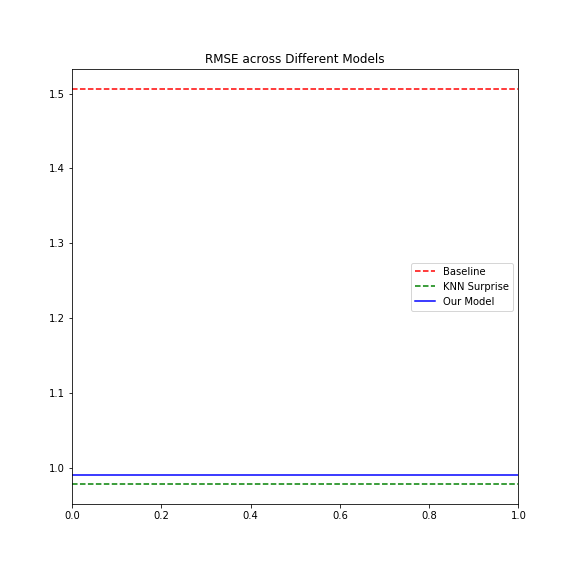

# Personalization Theory Project Approximate Nearest Neighbours

### Model Description
- One of the main drawbacks for Collaborative Filtering Models is that they do not scale well. As the size of the Dataset starts increasing, the sparsity of the Matrix increases. 
- Time required to calculate the similarity matrix also starts increasing and it becomes really tough to update the model periodically 
- Locality Sensitive Hashing attempts to combat that by approximating the neighbourhood of a user/item and using that to calculate the similarities between the users. This is done by using hashing functions and identifying the users who have fallen in the same bucket. 

### Description of the Algorithm 
- We have written our own algorithm that implements the Locality Sensitive Hashing in Python. 
- We first initialized the random hashing functions and computed the values for all the Movie IDs
- We then took the minimum value for for each user across all the hash functions to create a signature matrix
- This signature matrix was divided into h/b rows of b bands 
- The users whose value matched in a particular band were put in a bucket.
- The Jaccard Similarity was calculated on the bucket. The neighbours for a user were those users in the bucket whose similarity score was above the threshold. 
- The predicted rating for a movie for a given user was weighted average of the similarity of the users who had watched that movie. The weights were the Jaccard Scores

### Handling of Edge Cases
- When a user is present in the test dataset but we do not have any information about that user in the training dataset, the model will return a prediction of 3 which is the middle value of the rating. A possible way to handle would be to ensure that the train test split is not done randomly and certain datapoints from each user is included in both the training and testing data. 
- If a user does not have any neighbours, we then return the mean rating of the user. Since there is so little information about these users, it would be better to keep them in the traininig data only until we start finding neighbours for this particular user. 

Both the above cases can be implemented when the model is run in production and needs to be updated regularly. That would allow us to learn about these users as they start exploring the platform. 

The total number of such cases in the test data was 2% and should not reflect on the accuracy of the model. 

## Parameters of the Model
- h - Number of hashing functions
- b - Number of Bands 
- Threshold for the similarity of the users
- K - Denoting the top K items to be recommended to a user


## Design Choices to consider
We tried to implement a different type of Approximate nearest neighbours which was described by the following [paper](Data/ANN.pdf)

The approach in this paper was first to find the no of buckets 2 users collided in. If that number was above a certain threshold, then the 2 users would be considered neihgbours of one another. The hashing family described in the paper was different to the one implemented by us. 

A basic running model using Pandas was implemented which needs to be optimized in Spark. 

## Parameter Tuning and optimal Model 
We trained our model on the 1M Dataset of Movielens and compared that with the benchmark provided by [Surprise](http://surpriselib.com). Tuning the parameters was also done on that dataset.Our parameters were tuned in the following [code](ANN/check_precision.py) and decided in the [jupyter notebook](ANN/ANN_Accuracy_Plots.ipynb). THe final choice for the parameters are 
- No of Hash Functions - 120 
- No of Bands - 40 
- Similarity Threshold - 0.05
- Prediction Threshold - 4

Or final model had a RMSE Value of 0.990 and a Precision Value of 0.803



We can see above that our model is not performing that well when compared with the KNN Model implemented by the surprise package. It performs significantly better than the random model present. The 2 modesl were implemented in the following [code](k_NN.py)

Looking at the time 


We see that our code which was implemented form scratch performs better than the code written and optimized by the surprise package. Our code leverages the power of Spark to do that

Implementing the package written in Spark would further speeden up our code. We can conclude that our code is 3 times faster and sacrifices a small bit of accuracy to achieve that. Our model will be able to scale well when deployed on the cloud. 

## Requirements
```
Java version : 1.8.0_192
Python version : 3.7
Spark Version : 2.3.2 using Scala Version 2.11.8
RAM : 16GB
Free Space : 20GB
```

### Reference environment
The pacakges used to run the approximate nearest neighbours can be found [here](Data/requirements.txt)
